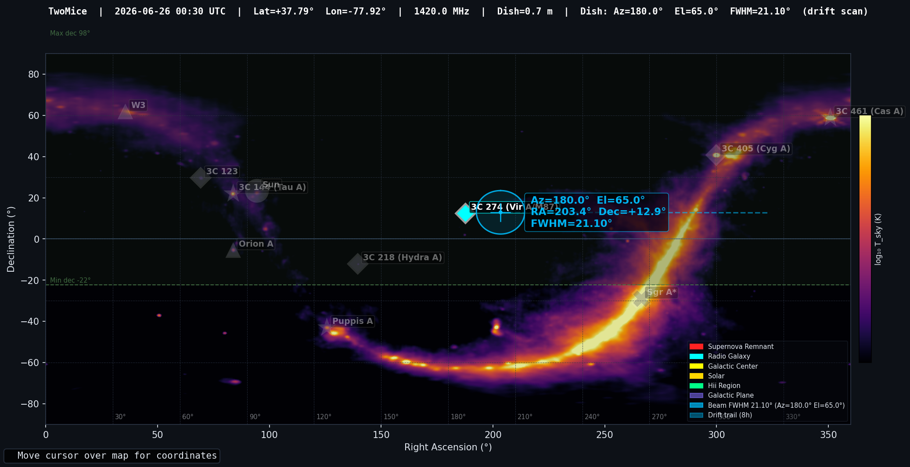

# Examples

This directory contains example output from Radio Planner.

## sample_report.txt

A typical observation report generated with:

```bash
python main.py --site my_site --beam-az 180 --beam-el 45 \
               --bandwidth 1.0 --integration 60 \
               --report sample_report.txt
```

The report includes:
- Site and antenna parameters
- Sensitivity calculation (RMS noise, detection limit)
- 24-hour observation schedule (rise/transit/set for all sources)
- Drift-scan beam transit predictions with timing and beam response

## Sky Map

A sample sky map is shown below. It is generated automatically when you
run the program and displays interactively with a live cursor readout.

To save a copy:
```bash
python main.py --site my_site --save-map skymap.png
```

The map shows:
- Global Sky Model background at your observing frequency (inferno colormap, log scale)
- Source markers with labels (white text, colored borders by source type)
- Beam footprint at the current pointing (Az/El)
- 24-hour drift trail showing which sources pass through the beam
- Transit highlights (cyan rings) on sources that cross the beam
- Galactic plane traced as a dotted curve
- Observable declination band for your site (green dashed lines)


